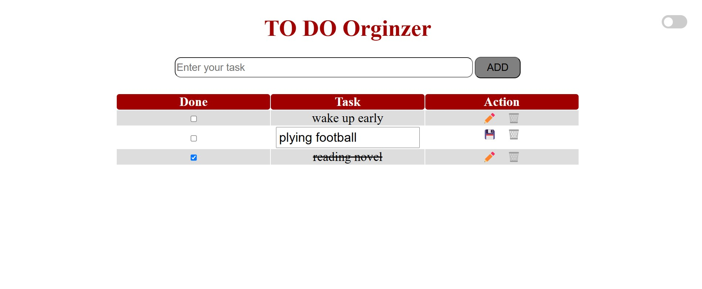

# To-Do List Application

 <!-- Add screenshot -->

A persistent task manager with dark mode functionality. Built with vanilla JavaScript to demonstrate core web concepts.

## Features
- ✅ Add/edit/delete tasks
- 💾 Automatic localStorage persistence
- 🌓 Light/dark mode toggle
- 📱 Responsive design
- 🎨 Clean UI with smooth interactions

## Tech Stack
- **Frontend**: HTML5, CSS3, JavaScript
- **Storage**: Browser localStorage API
- **Design**: CSS Flexbox, CSS Variables

## Installation
1. Clone repo
```bash
git clone https://https://github.com/abdallaskar/Todo_list_app.git
