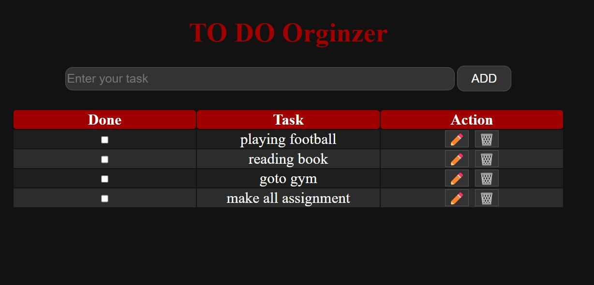

# 📝 To-Do List Application

  
_A clean, intuitive task manager with persistent storage_

## ✨ Features

| 💡 Feature          | ✅ Description                                                        |
| ------------------- | --------------------------------------------------------------------- |
| ✅ Task Management  | Add, edit, delete, and check off your daily tasks                     |
| 💾 Data Persistence | Tasks and their statuses are saved automatically using `localStorage` |
| 🌓 Dark/Light Mode  | Toggle between light and dark themes easily                           |
| 📱 Fully Responsive | Designed with Flexbox — fits beautifully on all screen sizes          |
| 🖋️ Editable Tasks   | Edit tasks inline and update instantly                                |
| ✅ Task Completion  | Task checkbox toggles strikethrough and saves state locally           |
| 🖼️ Clean UI         | Minimal design with smooth hover effects & animations                 |

--- |

## 🛠️ Tech Stack

**Frontend**  


**Key Technologies**

- localStorage for data persistence
- CSS Variables for theming
- Flexbox for layout
- DOM Manipulation

## 🚀 Getting Started

### 🔗 Live Demo

➡️ [Try it now!](https://youtu.be/1K8G1ki8Drs)

### Installation

```bash
git clone https://github.com/abdallaskar/Todo_list_app.git
cd Todo_list_app

```
