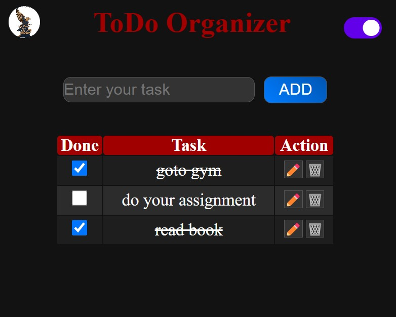

# 📝 To-Do List Application

  
_A clean, intuitive task manager with persistent storage_

## ✨ Features

| Feature              | Description                                  |
| -------------------- | -------------------------------------------- |
| ✅ Task Management   | Add, edit, and delete tasks with ease        |
| 💾 Data Persistence  | Automatically saves tasks using localStorage |
| 🌓 Dark/Light Mode   | Eye-friendly theme switching                 |
| 📱 Responsive Design | Works on all device sizes                    |
| 🎨 Interactive UI    | Smooth animations and feedback               |

## 🛠️ Tech Stack

**Frontend**  


**Key Technologies**

- localStorage for data persistence
- CSS Variables for theming
- Flexbox for layout
- DOM Manipulation

## 🚀 Getting Started
# 📝 To-Do List Application

  
_A clean, intuitive task manager with persistent storage_

## ✨ Features

| Feature              | Description                                  |
| -------------------- | -------------------------------------------- |
| ✅ Task Management   | Add, edit, and delete tasks with ease        |
| 💾 Data Persistence  | Automatically saves tasks using localStorage |
| 🌓 Dark/Light Mode   | Eye-friendly theme switching                 |
| 📱 Responsive Design | Works on all device sizes                    |
| 🎨 Interactive UI    | Smooth animations and feedback               |

## 🛠️ Tech Stack

**Frontend**  


**Key Technologies**  
- localStorage for data persistence
- CSS Variables for theming
- Flexbox for layout
- DOM Manipulation

## 🚀 Getting Started

### 🔗 Live Demo  
➡️ [Try it now!](https://youtu.be/1K8G1ki8Drs)  

### Installation  
```bash
git clone https://github.com/abdallaskar/Todo_list_app.git
cd Todo_list_app
### Installation

```bash
git clone https://github.com/abdallaskar/Todo_list_app.git
cd Todo_list_app
```
